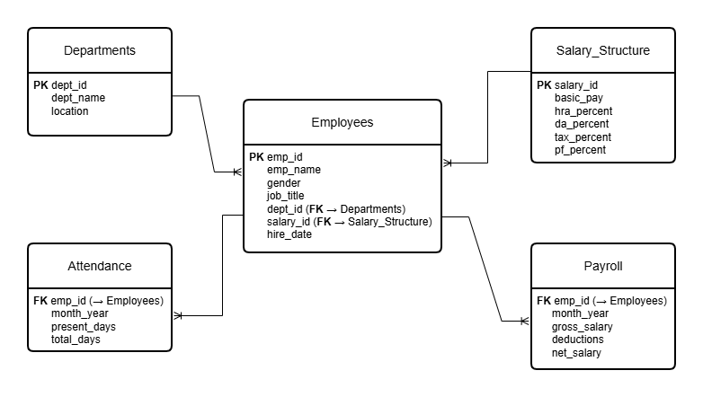
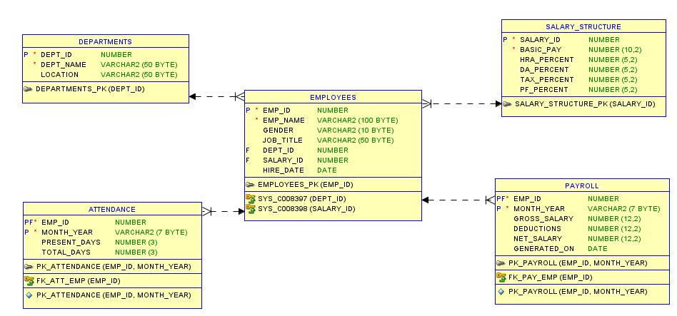
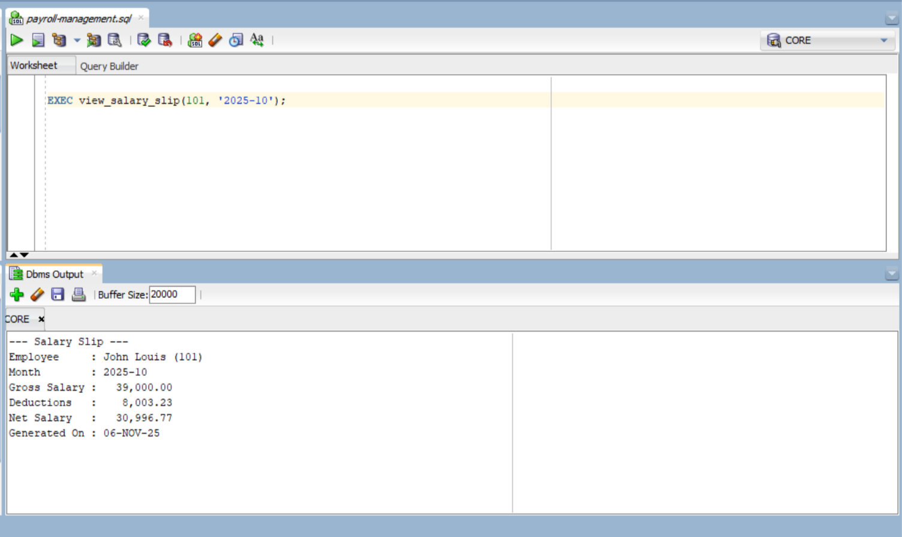
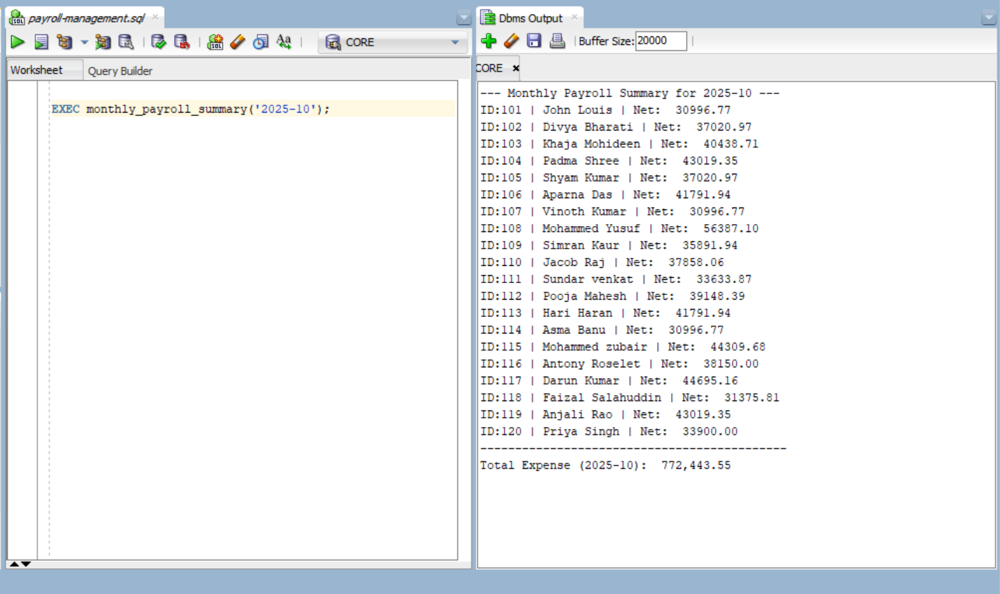

# 💼 Payroll Management System — Oracle Database Project

**Author:** Arabsha 
**Date:** October 2025  
**Project Type:** Self Project  
**Tools & Technologies:** Oracle SQL, PL/SQL, SQL Developer  

---

## 🧾 Overview

The **Payroll Management System** is a complete Oracle-based database project designed to automate the payroll process for employees.  
It manages **departments, employees, attendance, salary structure, and payroll** using relational tables and **PL/SQL** programs.  

The project focuses on database design, normalization, data integrity, and process automation through **stored procedures, functions, and triggers**.

---

## 🚀 Features

- ✅ **Normalized database design** with relational integrity (5+ tables).  
- ✅ **Automated payroll calculation** (gross, deductions, net salary) using PL/SQL procedures.  
- ✅ **Data validation** with constraints and a before-insert/update trigger.  
- ✅ **Reusable functions and procedures** for payroll generation and salary viewing.  
- ✅ **Sample data** for 20+ employees to simulate real-world payroll operations.  
- ✅ **Modular SQL scripts** (schema, data, procedures, triggers) for clarity and maintainability.  

---

## 🧩 Database Design (Schema Overview)

| Table Name | Description |
|-------------|--------------|
| **DEPARTMENTS** | Stores department names and locations |
| **SALARY_STRUCTURE** | Contains base pay and percentage components (HRA, DA, TAX, PF) |
| **EMPLOYEES** | Holds employee details with department and salary links |
| **ATTENDANCE** | Tracks monthly attendance (emp_id + month_year) |
| **PAYROLL** | Stores gross, deductions, and net salary after generation |

📘 **ER Diagram:** See [`docs/ER-diagram.png`](docs/ER-diagram.png)

---

## 🧠 PL/SQL Components

| Type | Name | Description |
|------|------|--------------|
| **Procedure** | `generate_payroll(emp_id, month_year)` | Generates payroll for one employee |
| **Procedure** | `generate_all_payroll(month_year)` | Generates payroll for all employees |
| **Procedure** | `view_salary_slip(emp_id, month_year)` | Displays detailed salary slip |
| **Procedure** | `monthly_payroll_summary(month_year)` | Lists all employees with net salary for a month |
| **Function** | `total_salary_expense(month_year)` | Returns total salary expense for the organization |
| **Trigger** | `trg_check_attendance` | Validates attendance before insert/update |

📄 Full code available in [`sql/03_procedures.sql`](sql/03_procedures.sql) and [`sql/04_triggers.sql`](sql/04_triggers.sql)

---

## 🗂️ Repository Structure

```
payroll-management-system/
├── README.md
├── LICENSE
├── .gitignore
├── sql/
│   ├── 01_schema.sql
│   ├── 02_sample_data.sql
│   ├── 03_procedures.sql
│   ├── 04_triggers.sql
│   └── 99_integrated_script.sql
├── docs/
│   ├── ER-diagram.png
│   └── screenshots/
│       ├── salary_slip_output.png
│       ├── monthly_summary_output.png
│       └── db_structure_view.png
├── scripts/
│   └── run_all.sh
└── samples/
    ├── sample_salary_slip.txt
    └── sample_month_summary.txt
```

---

## ⚙️ How to Run the Project

### **1️⃣ Clone the Repository**
```bash
git clone https://github.com/Arabsha/payroll-management-system.git
cd payroll-management-system/sql
```

### *2️⃣ Run Scripts in Oracle SQL Developer or SQL\*Plus*

#### 🖥️ Option A — Using Oracle SQL Developer (Recommended)
1. Open Oracle SQL Developer.
2. Connect to your Oracle Database (e.g., user CORE).
3. Open each script from the sql/ folder in this order:
   - 01_schema.sql
   - 02_sample_data.sql
   - 03_procedures.sql
   - 04_triggers.sql
4. Press *F5 (Run Script)* to execute each file.

#### 💻 Option B — Using SQL\*Plus (Command Line)
```bash
sqlplus username/password@DB @01_schema.sql
sqlplus username/password@DB @02_sample_data.sql
sqlplus username/password@DB @03_procedures.sql
sqlplus username/password@DB @04_triggers.sql
```

### **3️⃣ Execute Payroll Generation**
```sql
-- Generate payroll for one employee
EXEC generate_payroll(101, '2025-10');

-- Generate payroll for all employees
EXEC generate_all_payroll('2025-10');
```

### **4️⃣ View Salary Slip**
```sql
EXEC view_salary_slip(101, '2025-10');
```

### **5️⃣ View Monthly Payroll Summary**
```sql
EXEC monthly_payroll_summary('2025-10');
```

### **6️⃣ Get Total Salary Expense**
```sql
SELECT total_salary_expense('2025-10') FROM dual;
```

---

## 🧮 Sample Output

**Salary Slip (Console Output)**  
```
--- Salary Slip ---
Employee : John Louis (101)
Month    : 2025-10
Gross    : 39000
Deductions: 8003.23
Net Salary: 30996.77
Generated On: 02-NOV-25
```

**Monthly Payroll Summary (Excerpt)**  
```
--- Monthly Payroll Summary for 2025-10 ---
ID:101 | John Louis | Net: 30996.77
ID:102 | Divya Bharati | Net: 37020.97
ID:103 | Khaja Mohideen | Net: 40438.71
...
```

---

## 🖼️ Screenshots

| Screenshot | Description |
|-------------|--------------|
|  | Entity Relationship Diagram |
|  | Database Structure View (Actual Schema from Oracle SQL Developer) |
|  | Sample Salary Slip Output |
|  | Monthly Payroll Summary Output |

> 💡 *Note:* The above screenshots showcase both the logical design (ER Diagram) and the actual database implementation (Database Structure),
> along with sample execution outputs from Oracle SQL Developer.

---

## 🧰 Tools & Technologies Used
- *Oracle Database 21c Express Edition (XE)*
- *Oracle SQL Developer 24.3.1*
- *PL/SQL*
- *Git & GitHub*

> Developed and tested using Oracle SQL Developer 24.3.1 connected to an Oracle Database 21c Express Edition instance for designing schema, executing SQL queries, and performing PL/SQL operations.

---

## 📊 Learning Outcomes

- Understanding of **database schema design and normalization**.  
- Experience with **PL/SQL programming (procedures, functions, triggers)**.  
- Knowledge of **data validation** and referential integrity.  
- Exposure to **real-world payroll automation logic**.  

---

## 🛠️ Future Enhancements

- Add **web-based front-end** (e.g., Python Flask or Java Spring) for payroll visualization.  
- Implement **role-based access control** for HR/Admin.  
- Add **unit testing** using `utPLSQL`.  
- Deploy using **Oracle APEX or Dockerized Oracle XE** for demo.

---

## 🧾 License
This project is licensed under the [MIT License](LICENSE).  
You are free to use, modify, and distribute this project with attribution.

---

## 🌐 Author
**Arabsha**  
💻 Aspiring Database Developer | SQL & PL/SQL Enthusiast  
📅 Project: Payroll Management System (Oracle DB) — October 2025  
🔗 [GitHub Profile](https://github.com/Arabsha)

---
